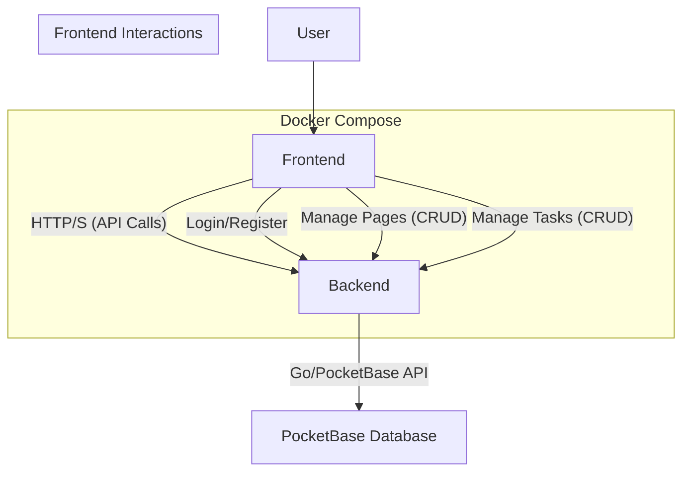

# High-Level Design (HLD)

## 1. Overview

This document outlines the high-level architecture and design of the Notion-like note-taking application. The application is designed as a multi-service application, containerized with Docker and orchestrated using Docker Compose.

## 2. Architecture

The system is composed of two main services, managed by Docker Compose:

-   **Frontend Application:** A Vue.js Single-Page Application (SPA) that runs in the user's browser. It is responsible for the user interface, user experience, and all client-side logic.
-   **Backend Service:** A custom Go application that embeds and utilizes PocketBase as a library, providing the database, user authentication, and a real-time API.

### 2.1. Frontend (Vue.js)

-   **Framework:** Vue.js 3 with the Composition API.
-   **Build Tool:** Vite for fast development and optimized builds.
-   **Routing:** `vue-router` handles all client-side routing, enabling seamless navigation without full page reloads.
-   **State Management:** `pinia` is used to manage global application state, including the authenticated user's session and cached data like the page tree.
-   **Styling:** TailwindCSS is used for a utility-first styling approach.
-   **Editor:** The editor component provides a side-by-side markdown editor and preview. It includes a toggle to show only the preview pane.
-   **Sidebar:** The sidebar displays a hierarchical view of pages. Child pages can be collapsed and expanded for better navigation.

### 2.2. Backend (Go with PocketBase)

-   **Language/Framework:** Go, embedding PocketBase as a library.
-   **Authentication:** PocketBase's built-in authentication is utilized through the Go application to manage users, sessions, and access control.
-   **Database:** PocketBase's integrated SQLite database stores all application data.
-   **API:** The Go application exposes a RESTful API and real-time capabilities provided by PocketBase.

## 3. Data Models (PocketBase Collections)

The following collections will be created in PocketBase:

### `users` (built-in)

-   Standard PocketBase users collection.

### `pages`

-   `title` (text, required)
-   `content` (json) - To store rich-text content from the editor (e.g., TipTap JSON output).
-   `parent` (relation to `pages`) - For creating hierarchical structures. Null for top-level pages.
-   `owner` (relation to `users`, required) - To enforce ownership and permissions.

### `tasks`

-   `title` (text, required)
-   `completed` (boolean, default: false)
-   `page` (relation to `pages`) - The page this task belongs to.
-   `owner` (relation to `users`, required)

## 4. Deployment with Docker Compose

Docker Compose is used to define and run the multi-container Docker application. The `docker-compose.yaml` file orchestrates the following services:

-   **`frontend`**: Builds the Vue.js application and serves it.
-   **`backend`**: Builds and runs the Go application, which includes the PocketBase instance.

This setup simplifies development, testing, and deployment by encapsulating each service and its dependencies within containers.

## 5. Core Feature Flow: Creating a Page

1.  User clicks "New Page" in the UI.
2.  The Pinia store updates the local state to show a new, unsaved page in the sidebar.
3.  The Vue.js client sends a `create` request to the PocketBase `pages` collection via the JS SDK. The request includes the `title`, an empty `content` object, the `owner` (current user's ID), and a `parent` ID if it's a sub-page.
4.  PocketBase creates the record and returns the new page object, including its ID.
5.  The client updates the page in the Pinia store with the ID received from the backend.

## 5. Core Feature Flow: Task Management

1.  When a user selects a page, the `TaskList` component is displayed.
2.  The `TaskList` component's `watch` hook on the `pageId` prop calls the `fetchTasks` action in the `tasks` Pinia store.
3.  The `tasks` store sends a `getList` request to the PocketBase `tasks` collection, filtering by the `pageId`.
4.  The UI displays the list of tasks.
5.  A user can add a new task by typing in the input field and clicking "Add". This calls the `createTask` action in the `tasks` store.
6.  A user can mark a task as complete by clicking the checkbox. This calls the `updateTask` action.
7.  A user can delete a task by clicking the delete button. This calls the `deleteTask` action.
